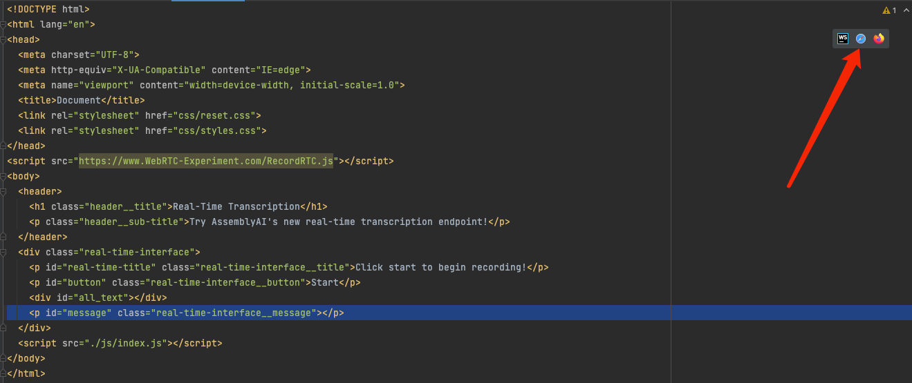
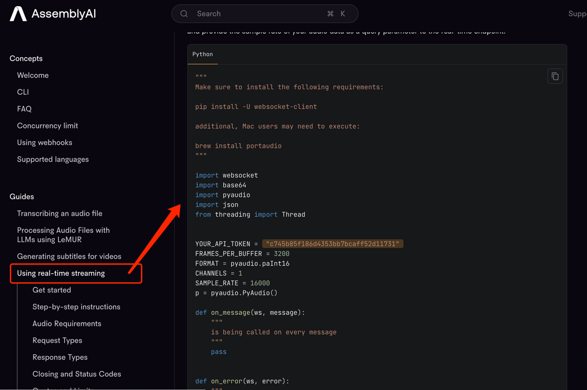

# AssemblyAI Real-Time Transcription Browser Example

This open-source repo provided by AssemblyAI displays how to use our real-time API in the browser!

This project borrows most of the functional code from  [realtime-transcription-browser-js-example](https://github.com/AssemblyAI/realtime-transcription-browser-js-example) but still make some changes for deploying on Heroku

## How To Install and Run the Project

##### ❗Important❗

- Before running this app, you need to upgrade your AssemblyAI account. The real-time API is only available to upgraded accounts at this time.
- Running the app before upgrading will cause an **error with a 402 status code.** ⚠️
- To upgrade your account you need to add a card. You can do that in your dashboard [here](https://app.assemblyai.com/)!

##### Instructions
##### run locally
1. Clone the repo to your local machine.
2. Open a terminal in the main directory housing the project. In this case `real-time transcript`.
3. Run `npm install` to ensure all dependencies are installed.
4. Add your AssemblyAI key to line 17 of `server.js`
5. Start the server with the command `npm start` (will run on port 30001).
6. find the `index.html` and click the following button to start the front-end interface:

##### deploy
1. register a heroku account
2. create a new app
3. deploy your codes to heroku and when the application deployed, you will get the server address
3. modify your `index.js` line27 to line28 and modify it to your own heroku server address
4. redeploy again

> it is kind of weird because you are asked to deploy for 2 times, but this is because at the very first time you deploy, your heroku server address is not visible, so that you cannot use it.
> So although we know the first deployment must be failed, we need to deploy it for the server address to modify the index.js.
## Further Documentation
- [AssemblyAI Real-Time Documention](https://www.assemblyai.com/docs/Guides/real-time_streaming_transcription)
- [recordrtc](https://www.npmjs.com/package/recordrtc)
- [Express](https://expressjs.com/)

-----
If you want to build this function with `python` you can get more details from the [Assembly AI official website](https://www.assemblyai.com/docs/Guides/real-time_streaming_transcription)
